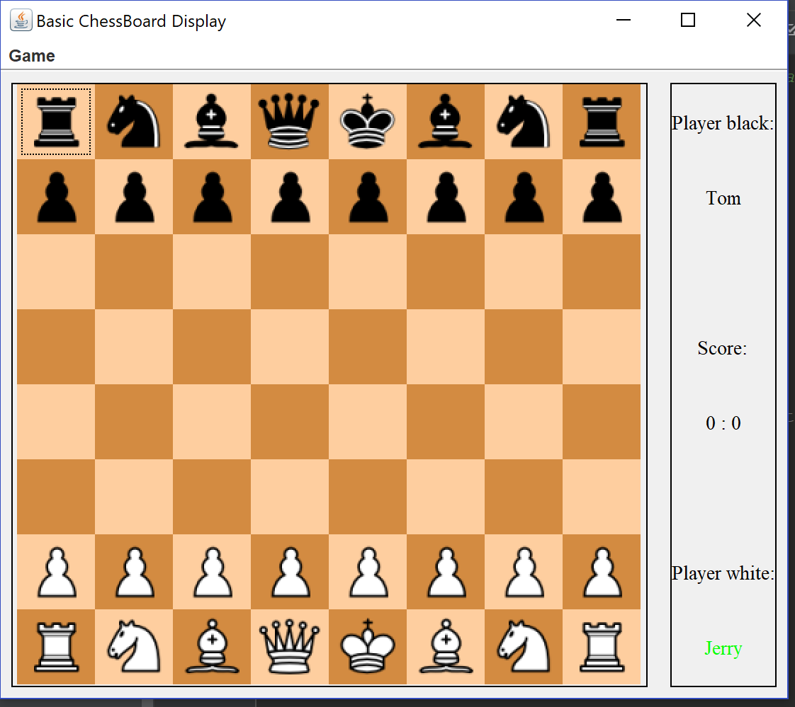
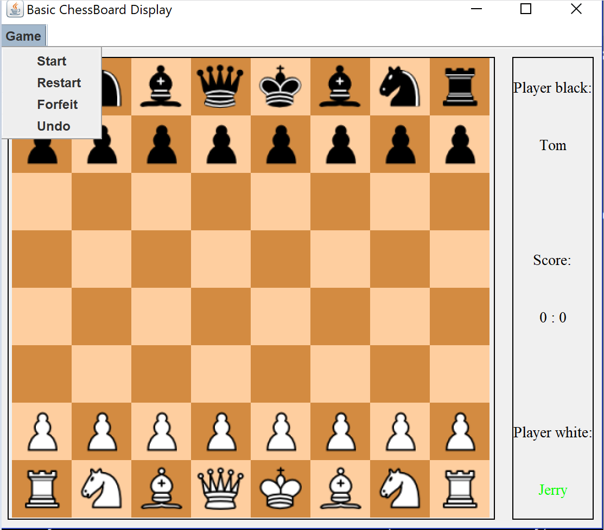
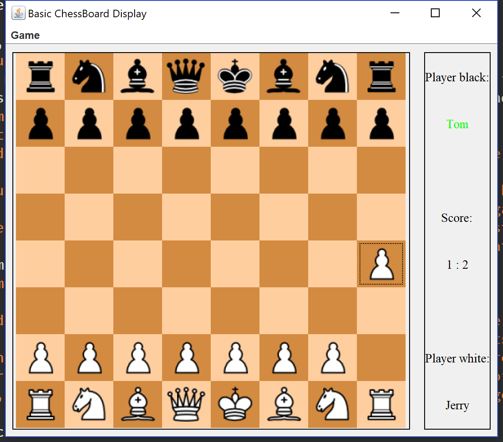
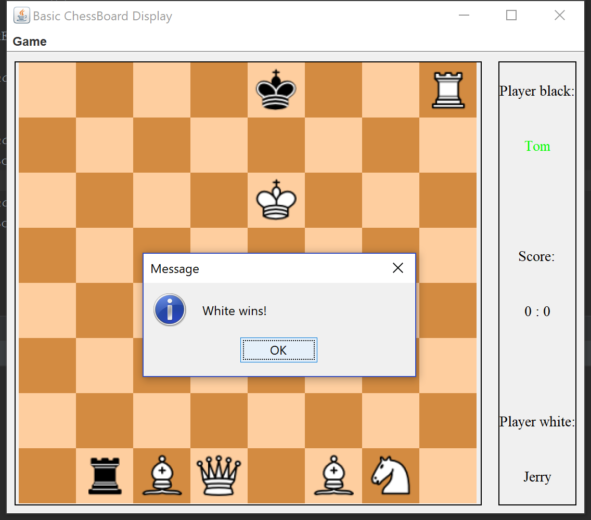

# Chess-Game
A Chess Game application

This application contains the following functionality:

0. Game Start, Restart, Forfeit operations allowed

1. Moving your chess piece (through chess rule)

2. Eating your opponent piece (through chess rule)

3. A score keeper

4. Checking your oppponent's king will mark you as win

5. Checkmate and Stalemate detector

6. Undo operation (as many as you want until reaching the start)

7. A fan made chess game version to play (contain 2 extras classes and new rules =w=)

You can use the following test plan to verify if this application is working correctly :)

### Test Plan

The Manual test for the GUI basically contain the following part:
    1. Starting app and Moving a piece works as expected
    2. Start/Restart/forfeit works as expected
    3. Undo works as expected
    4. CheckMate or check works as expected
    
### Starting app and Moving a piece works as expected

Run Main in folder src. if following application generates, it means the code runs correctly.

The left(center) part is the chessboard panel. It is mainly where game events happen. The right part is the info panel. It contains the infomartion of players as well as their scores. As seen, Tom is player black's username and Jerry is player white's username. As the game just started, their score is 0 : 0. As also seen, Jerry is colored green, which stands for the current player to make a move(player with white chess moves first).

To test if game logic and piece movement goes smoothly, you can try the following
    1. Player white should always be the first to move, and then player black and so on. If you try to move player black first, or move from some empty cell. The message box with "You must select your piece" will come up
    2. For all pieces, try all their legal movement as well as illgeal one. If movement is illegal, message box with "Cannot move to this position" will come up
    3. If you select a cell and select the same cell again, the system will treat you as misclicking and cancel your previous selection. No annoying message box will show up, and board panel configuartion with info panel configuartion are kept
    4. Try eating each other piece from as much situation as possible. Eating a piece will cause the piece in that destination to disappear and the piece that eats move to that location. Doing so will not cause repeating piece to generate and the turn moves to oppoenet and the game will run smoothly
    5. If King is checked or checkmated, the message box with "Winner appears" will show up and the coressponding score will be updated. Clicking Start/Restart will start another round and will not cause any issue

### Start/Restart/forfeit works as expected

Clicking the Game menu, you will see the following.

The menu contains four main game event besides just moving the piece. To me I feel like Start and Restart works the same so you should expect the same thing happen when testing. To test whether start and restart works smoothly, you could try
    1. start moving some pieces(white first, the black, then white and so on)
    2. click start/restart
    3. the board should look very similar to the one when you first starts the game like the first picture except previous score is kept
    4. Other things you could check is: The green highlight color should come back to the white player; The white player can move the piece and black player cannot right after you start/restart the game; If there is some score on the info panel, the score should remain the same after you start/restart the game; After start/restart the game, moving a piece will work smoothly, not causing other piece to move or extra piece being generated.
To test the forfeit game action, you could try
    1. start moving some pieces(white first, the black, then white and so on)
    2. click forfeit
    3. the board should look very similar to the one when you first starts the game like the first picture except the score
    4. Other things to check is: If the current player is white and he forfeits, the score will give to the black, and will to the white if otherwise; Forfeit will cause the board configuration to reset and the current player to white; After for forfeit, player white should be first able to move the piece instead of player black. After forfeit, moving a piece will work smoothly, not causing other piece to move or extra piece being generated.
    
### Undo works as expected

For undo game event, each undo operation is done for the player in previous turn. you can keep undoing to your oldest game state(gamestart) if you want. Some examples are shown below.
Move a piece:

Click undo:

Move piece again:

To check if undo works as expected, you could try 
    1. Use undo for piece will reverse the board configuration to exactly previous configuartion as it is
    2. After using undo, the turn will be for previous player. If current player is player black, undo will revert it back to player white and vice versa.
    3. For pawn(special case cause it can move two steps in the firs turn), make sure if it was first turn for pawn in the previous turn, after undo pawn can still move forward 1 to 2 steps and vice versa.   
    
### CheckMate or check works as expected

The application contains CheckMate and check detecting feature that will check for every game loop. If it detects, the message box from below will pop up.

To test CheckMate or check is really working, you could try
    1. try all possible checkmate or check situation( or 20 pages long :) ) to see such message box pops up
    2. after message box has shown the score will be updated, you cannot make any piece movement for either player, you will have to start/restart the game in order to get going.

